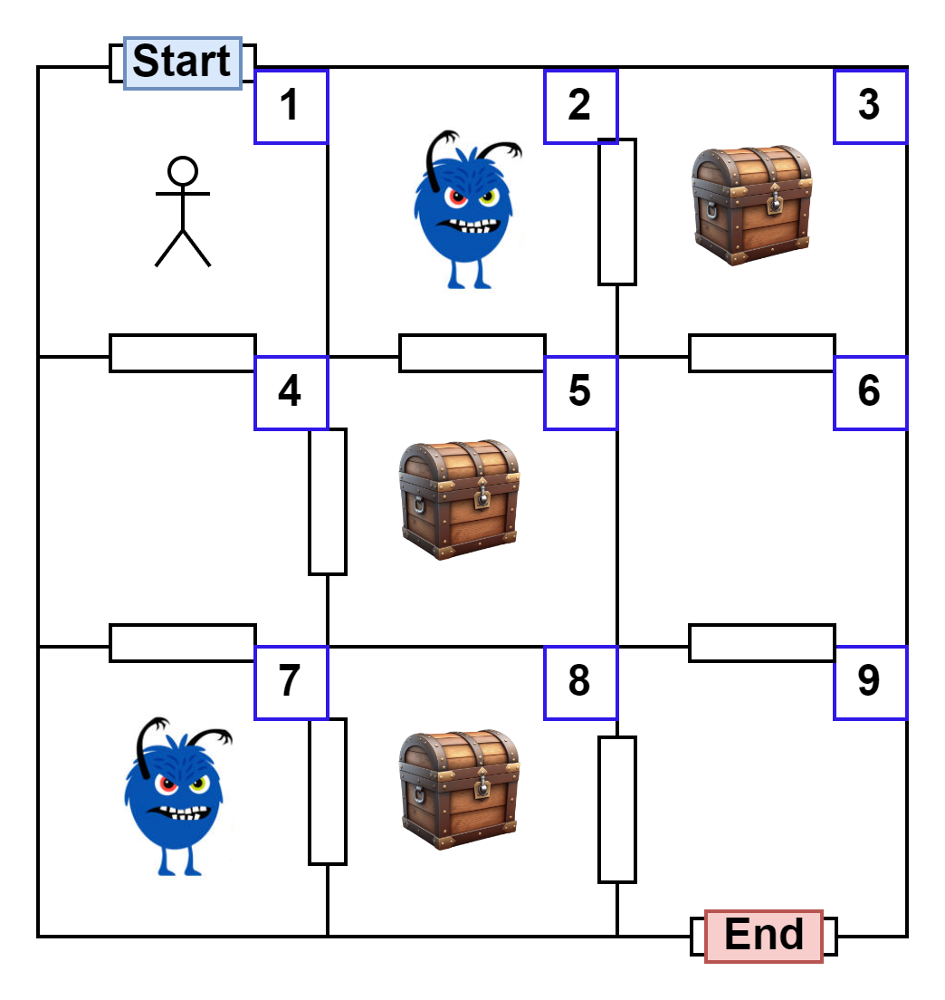

# VK Underground Game API 2024

## Требование

- PHP 8.2
- Composer

## Установка

1. Запустите `composer install`

## Running

1. Запустите `php -S localhost:8080 -t ./public`
1. Откройте коллекцию из репозитория в Postman, чтобы просмотреть примеры и протестировать API.
1. Наслаждаться!

## Конечные точки

- `POST /api/game/start`
    - **Body**:
        - `enter_room`: integer
        - `exit_room`: integer
        - `rooms`: 
          - `type`: array
          - `items`:
            - `type`: object
            - `properties`:
              - `room_number`: integer
              - `type`: string
              - `connected_rooms`: array
                - `items`:
                  - `type`: integer
              - `visited`: boolean
    - **Описание**: Конечная точка для инициализации игры.
- `POST /api/game/move`
    - **Body**:
        - `room_number`: integer
    - **Описание**: Конечная точка перемещения игрока.
- `game /api/game/min-path`
    - **Описание**: Конечная точка для поиска минимального пути.

### Пример

#### Инициализация игры:
```json
{
    "enter_room": 1,
    "exit_room": 9,
    "rooms": [
    {
      "room_number": 1,
      "type": "empty",
      "connected_rooms": [4],
      "visited": false
    },
    {
      "room_number": 2,
      "type": "monster",
      "connected_rooms": [3, 5],
      "visited": false
    },
    {
      "room_number": 3,
      "type": "chest",
      "connected_rooms": [2, 6],
      "visited": false
    },
    {
      "room_number": 4,
      "type": "empty",
      "connected_rooms": [1, 5, 7],
      "visited": false
    },
    {
      "room_number": 5,
      "type": "chest",
      "connected_rooms": [2, 4],
      "visited": false
    },
    {
      "room_number": 6,
      "type": "empty",
      "connected_rooms": [3, 9],
      "visited": false
    },
    {
      "room_number": 7,
      "type": "monster",
      "connected_rooms": [4, 8],
      "visited": false
    },
    {
      "room_number": 8,
      "type": "chest",
      "connected_rooms": [7, 9],
      "visited": false
    },
    {
      "room_number": 9,
      "type": "empty",
      "connected_rooms": [6, 8],
      "visited": false
    }
    ]
}
```



#### Перемещение игрока:

```json
{
    "room_number": 7
}
```